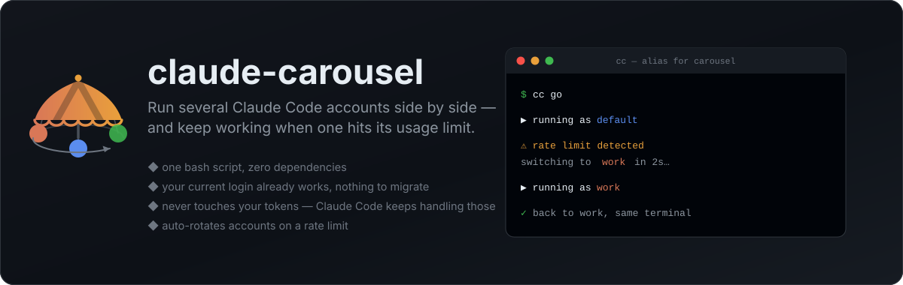

<p align="center">
  
</p>

<p align="center">
  <a href="https://github.com/jungjoongi/claude-carousel/blob/main/LICENSE"></a>
  <a href="https://github.com/jungjoongi/claude-carousel/stargazers"></a>
  
  
</p>

<p align="center">
  <a href="README.md">English</a> ·
  <b>한국어</b> ·
  <a href="README.ja.md">日本語</a> ·
  <a href="README.zh-CN.md">简体中文</a>
</p>

# 🎠 claude-carousel

**bash 스크립트 한 개, 의존성 제로.** 여러 Claude Code 계정을 나란히 쓰고, 한 계정이 사용량
한도에 걸려도 작업을 계속하세요.

`cc go`는 Claude Code를 실행한 뒤 rate-limit 메시지를 감시하다가, 감지되면 다음 계정으로
자동 재실행합니다. 빌드할 것도, 상주 데몬도, 손으로 고칠 설정 파일도 없습니다 — bash와 이미
설치된 `claude` CLI만 있으면 됩니다.

```console
$ cc ls
   PROFILE        ACCOUNT                        CLAUDE_CONFIG_DIR
   -------------- ------------------------------ ------------------
   default *      me@personal.dev                /Users/me/.claude
   work           me@company.com                 /Users/me/.claude-carousel/profiles/work
   oss            me+oss@personal.dev            /Users/me/.claude-carousel/profiles/oss

$ cc go
▶ running as default
⚠ rate limit detected on default — switching to work in 2s (Ctrl-C to stop)
▶ running as work
```

> 위의 `cc`는 설치 스크립트가 등록을 제안하는 짧은 alias입니다. 이 README의 모든 예제는
> `carousel …`로 써도 똑같이 동작합니다.

## bash 스크립트 한 개, 의존성 제로

도구 전체가 약 500줄짜리 bash 스크립트 하나입니다. 그 외에는 아무것도 없습니다.

- **스크립트 말고는 설치할 게 없습니다.** macOS 기본 bash 3.2에서 그대로 돕니다 — Homebrew bash도, Python 런타임도, 빌드해야 하는 Rust 바이너리도, Electron 앱도, 백그라운드 데몬도 없습니다. `PATH` 아무 곳에 넣으면 끝이고, 삭제는 파일 하나 지우는 일입니다.
- **한 번에 다 읽어볼 수 있습니다.** 내 Claude 계정과 나 사이에 끼어드는 도구라면 컴파일된 바이너리가 아니라 읽을 수 있는 코드여야 합니다. 몇 분이면 위에서 아래까지 훑을 수 있는 평범한 셸 스크립트이고, Claude Code가 뭔가 바뀌는 날 직접 고칠 수 있습니다.
- **마이그레이션 불필요.** 지금 로그인해 쓰고 있는 계정이 곧 `default` 프로필입니다. 기존과 똑같이 동작하고, `claude` 명령 자체는 절대 가로채거나 감싸지 않습니다.
- **인증정보는 OS가 두는 자리에 그대로.** carousel은 토큰을 읽거나 쓰거나 복사하거나 저장하지 않습니다. `CLAUDE_CONFIG_DIR`을 프로필별 디렉터리로 가리키게만 하고, 나머지는 Claude Code의 `/login`이 알아서 합니다 — macOS는 키체인, Linux는 로컬 파일.
- **디스크 중복 없음.** `plugins/`, `skills/`, `projects/`는 원래의 `~/.claude`로 심볼릭 링크되므로, 프로필을 하나 더 만드는 비용이 800MB가 아니라 수십 KB입니다.
- **rate-limit 로테이션**이 별도 모드가 아니라 같은 스크립트에 들어 있습니다.

## 설치

```bash
curl -fsSL https://raw.githubusercontent.com/jungjoongi/claude-carousel/main/install.sh | bash
```

직접 설치하려면:

```bash
git clone https://github.com/jungjoongi/claude-carousel.git
install -m 755 claude-carousel/bin/carousel ~/.local/bin/carousel   # PATH에 있는 아무 곳
```

요구 사항: bash 3.2 이상, `python3`(macOS 기본 포함 — Claude Code의 JSON에서 계정 이메일을 읽는 데만 씁니다), `claude` CLI, 그리고 `cc go`를 쓰려면 `script`(macOS와 거의 모든 Linux 배포판에 기본 포함).

## 빠른 시작

```bash
cc ls                  # 지금 쓰는 로그인이 이미 "default"로 보입니다
cc add work            # 두 번째 프로필 생성
cc login work          # 로그인 (평소의 Claude Code 로그인 절차)

cc work                # "work" 계정으로 Claude Code 실행
cc                     # 기본 프로필로 실행
cc use work            # "work"를 기본 프로필로 지정

cc order default work  # "go"가 돌 순서
cc go                  # 실행하다 한도에 걸리면 다음 계정으로 자동 전환
```

터미널을 두 개 열면 두 계정을 동시에 쓸 수 있습니다. 프로필마다 인증 슬롯이 분리돼 있어서
세션끼리 토큰을 두고 다투지 않습니다.

## 명령어

| 명령어 | 설명 |
|---|---|
| `cc ls` | 프로필 목록과 각 프로필이 로그인한 계정 표시 |
| `cc add <이름>` | 프로필 생성 |
| `cc login <이름>` | 해당 프로필로 Claude Code 로그인 절차 실행 |
| `cc <이름> [인자…]` | 그 프로필로 Claude Code 실행 (추가 인자는 그대로 전달) |
| `cc` | 기본 프로필로 실행 |
| `cc [claude 인자…]` | 기본 프로필로 실행 — `-`로 시작하는 인자는 전부 `claude`로 |
| `cc use <이름>` | 기본 프로필 지정 |
| `cc whoami` | 현재 셸이 어느 프로필인지 확인 |
| `cc order [이름…]` | 로테이션 순서 조회/설정 |
| `cc go [인자…]` | rate-limit 자동 로테이션과 함께 실행 |
| `cc sync [이름]` | `~/.claude`의 공유 플러그인·설정 다시 연결 |
| `cc rm <이름>` | 프로필 삭제 (심볼릭 링크만 해제, 원본은 그대로) |
| `cc alias [이름]` | 짧은 셸 alias 등록/변경 (`--remove`로 해제) |
| `cc doctor` | 환경 및 문제 해결 정보 |
| `cc update` | 지금 carousel 업데이트 (하루 한 번 자동으로도 갱신) |
| `cc help` | carousel 도움말 (`cc --help`는 Claude Code 쪽) |
| `cc version` | carousel 버전 (`cc --version`은 Claude Code 쪽) |

## 짧은 alias

`carousel`은 타이핑이 깁니다. 그래서 설치 스크립트가 짧은 alias를 제안합니다 — 기본값은 `cc`이고
엔터만 누르면 등록됩니다. 언제든 직접 바꿀 수도 있습니다.

```bash
carousel alias cc        # 이제 "cc"가 carousel 실행
carousel alias           # 등록된 alias 확인
carousel alias --remove  # 해제
```

**바이너리 이름을 그냥 `cc`로 하지 않고 alias를 쓰는 이유는?** `cc`는 C 컴파일러이기도 해서,
`PATH`에 `cc`라는 바이너리를 두면 `make` 같은 도구가 그걸 집어 빌드가 깨집니다. 셸 alias는
*사람이 직접* 입력할 때만 적용되므로, 프롬프트에서는 `cc go`가 되고 `make`는 계속 진짜
`/usr/bin/cc`를 씁니다. 짧은 명령어는 그대로 얻고 부작용은 없습니다.

셸 rc 파일(`~/.zshrc`, `~/.bashrc`, fish의 `config.fish`)에 표식이 있는 블록으로 기록하므로,
나중에 바꾸거나 지워도 깔끔합니다.

```bash
# >>> claude-carousel alias >>>
alias cc='carousel'
# <<< claude-carousel alias <<<
```

고른 이름이 이미 쓰이고 있으면, 조용히 덮어쓰지 않고 알려줍니다.

- **이미 있는 내 alias** (예: `alias cc='claude …'`) — 해당 줄을 그대로 보여주고 주석 처리할지 물어봅니다. 아니라고 하면 아무것도 건드리지 않습니다.
- **같은 이름의 실제 명령어** — 어떤 바이너리인지 알려주고, alias는 내가 직접 입력할 때만 그것을 가린다는 점을 다시 확인해줍니다.

## 동작 원리

Claude Code는 `CLAUDE_CONFIG_DIR`을 보고 자기 상태를 어디에 둘지 결정합니다. 이걸 다른
디렉터리로 가리키면, 신원 측면에서는 완전히 별개의 설치본이 됩니다 — 자체 `.claude.json`
(`oauthAccount`가 여기 들어 있습니다), 자체 세션 이력, 자체 인증 슬롯. macOS에서는 Claude Code가
그 경로로 키체인 서비스 이름을 만들기 때문에, 프로필별 OAuth 토큰이 각자의 항목에 자동으로
저장됩니다.

carousel은 본질적으로 그 환경변수 하나를 둘러싼 약간의 정리 작업입니다.

```
~/.claude                              ← "default" 프로필, 손대지 않음
~/.claude-carousel/
├── default                            ← 기본 프로필 이름
├── order                              ← `go`의 로테이션 순서
├── alias                              ← 등록된 셸 alias 이름
└── profiles/
    └── work/
        ├── .claude.json               ← 이 프로필의 신원 + 세션 상태
        ├── plugins  -> ~/.claude/plugins    (심볼릭 링크)
        ├── skills   -> ~/.claude/skills     (심볼릭 링크)
        ├── projects -> ~/.claude/projects   (심볼릭 링크)
        └── settings.json              ← 실행할 때마다 ~/.claude에서 복사
```

`settings.json`은 심볼릭 링크가 아니라 복사입니다. Claude Code가 이 파일을 atomic write로
다시 쓰는데, 그러면 심볼릭 링크가 일반 파일로 대체되기 때문입니다.

## rate-limit 로테이션, 솔직하게

`cc go`는 Claude Code를 pty 안에서(`script` 사용) 실행하면서 출력을 터미널에 그대로
보여주고, 동시에 캡처한 내용에서 `usage limit`, `rate limit`, `limit will reset` 같은 문구를
grep합니다. 찾으면 `cc order`의 다음 프로필로 넘어가 재실행합니다.

분명히 말해둘 두 가지:

1. **휴리스틱입니다.** Claude Code의 정확한 문구는 릴리스마다 바뀔 수 있습니다. 로테이션이
   발동해야 하는데 안 되면 스크립트 상단의 `RATE_LIMIT_PATTERN`을 고치세요 — 일부러 눈에 잘
   띄는 한 곳에 둔 평범한 `grep -E` 패턴입니다. 이걸 갱신하는 PR은 특히 환영합니다.
2. **실제 터미널이 필요합니다.** CI처럼 pty를 주지 않는 환경에서는 실패하지 않고, 경고를 띄운
   뒤 로테이션 없이 그냥 실행합니다.

## bypass 모드

모든 실행에 `--dangerously-skip-permissions`가 붙습니다. 매 작업마다 확인을 받지 않고 진행하며,
애초에 계정을 여러 개 돌리는 목적이 대개 그것이기 때문입니다. 확인 프롬프트를 그대로 두고
싶다면:

```bash
export CAROUSEL_BYPASS=0
```

직접 `--permission-mode …`나 skip 플래그를 넘기면 이 설정보다 항상 우선합니다.

## Claude Code에 인자 전달하기

carousel이 모르는 인자는 전부 `claude`로 그대로 넘어갑니다. 쓰던 플래그가 그대로 동작합니다.

```bash
cc --resume                 # 기본 프로필로 claude --resume
cc -p "이 저장소 요약해줘"    # claude -p "…"
cc work --model opus        # "work" 프로필로
cc go --resume              # rate-limit 로테이션과 함께
```

예외는 없습니다. **`-`로 시작하면 전부 Claude Code의 것입니다.** carousel 명령은 모두
띄어쓰기로 구분되는 맨단어라서 둘이 겹칠 일이 없습니다.

```bash
cc --help        # claude 도움말
cc help          # carousel 도움말
cc --version     # claude 버전
cc version       # carousel 버전
```

## 최신 버전 유지

carousel은 파일 하나라, 업데이트도 그 파일을 다시 받아오는 것이 전부입니다. carousel을
통해 Claude Code를 실행하면 하루에 최대 한 번 GitHub에서 새 버전을 확인하고, 원자적으로
자기 자신을 교체한 뒤 입력한 명령을 그대로 다시 실행합니다. 이때만 한 줄이 출력됩니다.

```console
$ cc
✓ carousel updated 0.2.0 → 0.3.0
```

내려받은 내용이 문법적으로 유효한 carousel 스크립트가 아니면 교체하지 않습니다. 터미널이
없을 때(CI, 스크립트 안의 `cc -p …`), carousel이 심볼릭 링크일 때, git 클론에서 실행할 때는
확인 자체를 건너뜁니다. `cc update`는 지금 바로 확인하고, `cc doctor`는 현재 상태를 보여줍니다.

```bash
export CAROUSEL_NO_UPDATE=1   # 확인하지 않음
```

## 설정

| 환경변수 | 기본값 | 용도 |
|---|---|---|
| `CAROUSEL_BYPASS` | `1` | `0`이면 Claude Code의 기본 권한 프롬프트를 유지 |
| `CAROUSEL_HOME` | `~/.claude-carousel` | 프로필과 설정이 저장되는 위치 |
| `CAROUSEL_CLAUDE_BIN` | `claude` | `claude` 바이너리 경로 |
| `CAROUSEL_NO_UPDATE` | `0` | `1`이면 하루 한 번의 자동 업데이트 확인을 끔 |
| `CAROUSEL_UPDATE_INTERVAL` | `86400` | 업데이트 확인 간격(초) |

## 라이선스

MIT
