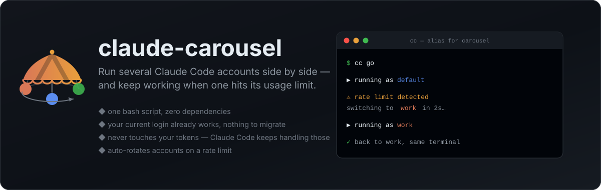

<p align="center">
  
</p>

<p align="center">
  <a href="https://github.com/jungjoongi/claude-carousel/blob/main/LICENSE"></a>
  <a href="https://github.com/jungjoongi/claude-carousel/stargazers"></a>
  
  
</p>

<p align="center">
  <b>English</b> ·
  <a href="README.ko.md">한국어</a> ·
  <a href="README.ja.md">日本語</a> ·
  <a href="README.zh-CN.md">简体中文</a>
</p>

# 🎠 claude-carousel

**One bash script, zero dependencies.** Run several Claude Code accounts side by side —
and keep working when one hits its usage limit.

`cc` launches Claude Code, and when a usage limit ends a turn it picks the same
conversation up on your next account, automatically. Nothing to build, no daemon, no config
file to hand-edit — just bash and the `claude` CLI you already have.

```console
$ cc ls
   PROFILE        ACCOUNT                        CLAUDE_CONFIG_DIR
   -------------- ------------------------------ ------------------
   default *      me@personal.dev                /Users/me/.claude
   work           me@company.com                 /Users/me/.claude-carousel/profiles/work
   oss            me+oss@personal.dev            /Users/me/.claude-carousel/profiles/oss

$ cc
▶ running as default
⚠ default: You've hit your session limit · resets 3pm
  switching to work and resuming the conversation in 2s (Ctrl-C to stop)
▶ running as work
```

> `cc` above is the short alias the installer offers to set up for you. Every example in
> this README works the same as `carousel …` if you'd rather not use one.

## One bash script, zero dependencies

The entire tool is a single ~500-line bash script. There is nothing else to it.

- **Nothing to install but the script.** It runs on macOS's stock bash 3.2 — no Homebrew bash, no Python runtime, no Rust binary to build, no Electron app, no background daemon. Drop it anywhere on your `PATH` and you're done; uninstalling is deleting one file.
- **Auditable in one sitting.** A tool that stands between you and your Claude accounts should be readable, not compiled. It's plain shell you can skim top to bottom in a few minutes — and patch yourself the day Claude Code changes something.
- **Nothing to migrate.** The account you're logged into right now is the `default` profile. It keeps working exactly as before, and `claude` on its own is never shadowed or wrapped.
- **Credentials stay where the OS wants them.** carousel never reads, writes, copies, or stores your tokens. It points `CLAUDE_CONFIG_DIR` at a per-profile directory and lets Claude Code's own `/login` handle the rest — Keychain on macOS, a local file on Linux.
- **No duplicated disk.** `plugins/`, `skills/`, and `projects/` are symlinked back to your main `~/.claude`, so a second profile costs kilobytes, not the ~800 MB a full plugin tree does.
- **Rate-limit rotation** on every run, rather than a separate mode you have to remember.

## Install

```bash
curl -fsSL https://raw.githubusercontent.com/jungjoongi/claude-carousel/main/install.sh | bash
```

Or by hand:

```bash
git clone https://github.com/jungjoongi/claude-carousel.git
install -m 755 claude-carousel/bin/carousel ~/.local/bin/carousel   # anywhere on your PATH
```

Requirements: bash 3.2+, `python3` (ships with macOS; used only to read small bits of Claude Code's JSON — the account email, and the session id a switch resumes), and the `claude` CLI.

## Quickstart

```bash
cc ls                  # your current login already shows up as "default"
cc add work            # create a second profile
cc login work          # log in to it (normal Claude Code login flow)

cc work                # run Claude Code as "work"
cc                     # run the default profile
cc use work            # make "work" the default

cc order default work  # the order a usage limit rotates through
```

Run two accounts at the same time by opening two terminals — each profile has its own
credential slot, so the sessions don't fight over a token.

## Commands

| Command | What it does |
|---|---|
| `cc ls` | List profiles with the account each is logged into |
| `cc add <name>` | Create a profile |
| `cc login <name>` | Open Claude Code's login flow for a profile |
| `cc <name> [args…]` | Run Claude Code as that profile, rotating from it on a usage limit (extra args pass through) |
| `cc` | Run the default profile |
| `cc [claude args…]` | Run the default profile — every `-`flag goes to `claude` |
| `cc use <name>` | Set the default profile |
| `cc whoami` | Which profile is the current shell in? |
| `cc order [names…]` | View or set the order a usage limit rotates through |
| `cc go [args…]` | Same as `cc`, and rotates even with `CAROUSEL_ROTATE=0` |
| `/carousel:switch [name]` | Inside a session: carry on the conversation as another profile |
| `cc sync [name]` | Re-link shared plugins/settings from `~/.claude` |
| `cc rm <name>` | Delete a profile (symlinks unlinked; originals untouched) |
| `cc alias [name]` | Register or change a short shell alias (`--remove` to undo) |
| `cc doctor` | Environment and troubleshooting info |
| `cc update` | Update carousel now (it also self-updates once a day) |
| `cc help` | carousel's own help (`cc --help` is Claude Code's) |
| `cc version` | carousel's own version (`cc --version` is Claude Code's) |

## A shorter alias

`carousel` is a lot to type, so the installer offers to register a short alias — `cc` by
default, Enter to accept. You can also set or change it whenever you like:

```bash
carousel alias cc        # "cc" now runs carousel
carousel alias           # show what's registered
carousel alias --remove  # undo it
```

**Why the alias instead of just naming the binary `cc`?** Because `cc` is also the C
compiler, and a binary named `cc` on your `PATH` gets picked up by `make` and friends —
that breaks builds. A shell alias only applies to what *you* type interactively, so `cc go`
works at your prompt while `make` keeps using the real `/usr/bin/cc`. Same short command,
none of the collateral damage.

It writes a marked block to your shell rc (`~/.zshrc`, `~/.bashrc`, or fish's
`config.fish`), so changing or removing the alias later is clean:

```bash
# >>> claude-carousel alias >>>
alias cc='carousel'
# <<< claude-carousel alias <<<
```

If the name you pick is already taken, carousel says so instead of silently clobbering it:

- **An alias you already have** (say `alias cc='claude …'`) — it shows you the exact line and
  asks before commenting it out. Answer no and nothing is touched.
- **A real command of the same name** — it warns you which binary it is, and reminds you that
  the alias only shadows it at your own prompt.

## How it works

Claude Code reads `CLAUDE_CONFIG_DIR` to decide where its state lives. Point it at a
different directory and you get a fully separate installation as far as identity is
concerned: its own `.claude.json` (which carries `oauthAccount`), its own session history,
and its own credential slot. On macOS, Claude Code derives the Keychain service name from
that path, so each profile's OAuth tokens land in their own entry automatically.

carousel is essentially a small amount of bookkeeping around that one environment variable:

```
~/.claude                              ← the "default" profile, untouched
~/.claude-carousel/
├── default                            ← name of the default profile
├── order                              ← rotation order for `go`
├── alias                              ← the shell alias you registered
└── profiles/
    ├── work.json -> work/.claude.json   ← status lines (claude-hud) read the account here
    └── work/
        ├── .claude.json               ← this profile's identity + session state
        ├── plugins  -> ~/.claude/plugins    (symlink)
        ├── skills   -> ~/.claude/skills     (symlink)
        ├── projects -> ~/.claude/projects   (symlink)
        ├── settings.json -> ~/.claude/settings.json   (symlink)
        └── settings.local.json        ← this profile's own overrides
```

`settings.json` used to be copied rather than symlinked, because Claude Code can rewrite it
atomically and a rename replaces a symlink with a regular file. Copying traded that away for a
worse problem: it only ever flowed one way, so a plugin you disabled or an MCP server you added
from inside a profile was silently reverted on the next launch. Since 0.3.0 it is symlinked like
everything else, and `sync` repairs the link when a rename does break it — promoting the profile's
version to `~/.claude` first, so the edit survives. Anything replaced is backed up under
`~/.claude-carousel/backups/<profile>/`.

`settings.local.json` is the exception. Claude Code treats it as a local override of
`settings.json`, so each profile keeps a real file of its own. That makes it the place to put
anything one profile should keep to itself — a different `model`, say — without forking the
shared configuration.

## Rate-limit rotation, honestly

Every interactive run rotates — `cc`, `cc <name>` and `cc go` alike. It starts on the
profile you asked for (the default, for plain `cc`) and moves through `cc order` from there,
wrapping around.

carousel doesn't read the screen to do it. It registers a `StopFailure` hook for that run only
(through `--settings`, so none of your settings files change). Claude Code fires that hook
when a turn ends on an API error and says which error it was; carousel listens for
`rate_limit`. When it fires, carousel:

1. stops that Claude Code,
2. moves to the next profile in `cc order`, and
3. relaunches it with `--resume <session-id>`, so you're back in the same conversation —
   transcripts live in `projects/`, which every profile shares.

It also sends one message, `You were cut off by a usage limit. Continue where you left off.`,
so a task you left running keeps going on its own. To land at the prompt instead, or to
word it your way:

```bash
export CAROUSEL_RESUME_PROMPT=          # resume, send nothing
export CAROUSEL_RESUME_PROMPT="continue" # or your own wording
```

Caveats worth stating plainly:

1. **Only the conversation carries over.** Arguments you gave the first launch — a prompt,
   `--resume`, `--model` — aren't repeated after a switch.
2. **It needs a Claude Code recent enough to have the `StopFailure` hook.** Without it, the
   limit shows up as usual and nothing switches.
3. **When every profile is limited, it stops** and prints the session id, so you can
   `cc --resume <id>` once a limit resets.
4. **`-p` runs don't rotate.** A script expects one process and one answer, so `cc -p …`
   goes straight to Claude Code.
5. **To stay on the profile you named**, `export CAROUSEL_ROTATE=0`. `cc go` still rotates
   with it set.

## Switching accounts mid-session

Inside a session carousel started, type:

```
/carousel:switch dev    # carry on this conversation as dev
/carousel:switch        # or as the next profile in `cc order`
```

(`/switch` and Tab completes it.) carousel stops that Claude Code and relaunches the profile
with `--resume <session-id>`, the same way a usage limit does, but it sends nothing, so you
land at the prompt. Rotation then carries on from the profile you switched to.

The command is loaded with `--plugin-dir` for that run only, together with a
`UserPromptSubmit` hook that catches it, so a plain `claude` session never has it. A profile
that doesn't exist, or the one you're already on, is refused in the session and nothing
restarts.

Caveats:

1. **Only the conversation carries over.** Arguments from the first launch, such as
   `--model`, aren't repeated.
2. **It needs a rotating run.** With `CAROUSEL_ROTATE=0`, or under `-p`, the command isn't there.
3. **The folder-trust question is asked once, not once per profile.** A folder you trusted in
   any profile (or a folder above it) is marked trusted in the profile carousel launches,
   including a new profile's first run under `carousel login`. As in Claude Code itself, a folder
   above a git repository doesn't count for the folders inside it.
4. **Claude Code is stopped, not exited**, so hooks that run at session end may be cut short.

## Bypass mode

Every run passes `--dangerously-skip-permissions`, so Claude Code doesn't stop to ask for
each action — which is usually the point of juggling accounts in the first place. If you'd
rather keep the prompts:

```bash
export CAROUSEL_BYPASS=0
```

Passing `--permission-mode …` or the skip flag yourself always wins over this setting.

## Passing arguments to Claude Code

Anything carousel doesn't recognise goes straight to `claude`, so the flags you already
use keep working:

```bash
cc --resume                 # claude --resume, as the default profile
cc -p "summarise this repo" # claude -p "…"
cc work --model opus        # …as the "work" profile
```

There are no exceptions: **anything starting with `-` belongs to Claude Code.** Every
carousel command is a plain word instead, so the two sets can never collide.

```bash
cc --help        # claude's help
cc help          # carousel's help
cc --version     # claude's version
cc version       # carousel's version
```

## Staying up to date

carousel is one file, so updating is just fetching it again. When you launch Claude Code
through it, carousel checks GitHub for a newer version at most once a day, replaces itself
atomically, and re-runs your command — you'll see a single line when it happens:

```console
$ cc
✓ carousel updated 0.2.0 → 0.3.0
```

The download is rejected unless it's a real, syntactically valid carousel script, and the
check is skipped entirely when there's no terminal (CI, `cc -p …` in a script), when
carousel is a symlink, or when it's running from a git clone. `cc update` forces a check
now; `cc doctor` shows the current state.

```bash
export CAROUSEL_NO_UPDATE=1   # never check
```

## Configuration

| Variable | Default | Purpose |
|---|---|---|
| `CAROUSEL_BYPASS` | `1` | `0` keeps Claude Code's normal permission prompts |
| `CAROUSEL_HOME` | `~/.claude-carousel` | Where profiles and settings live |
| `CAROUSEL_CLAUDE_BIN` | `claude` | Path to the `claude` binary |
| `CAROUSEL_NO_UPDATE` | `0` | `1` turns off the daily self-update check |
| `CAROUSEL_UPDATE_INTERVAL` | `86400` | Seconds between update checks |

## License

MIT
